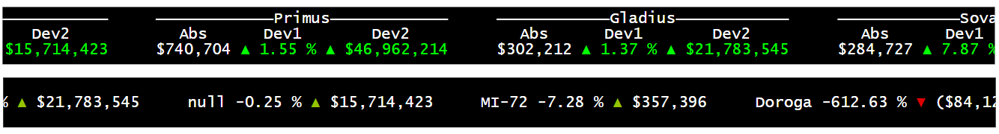
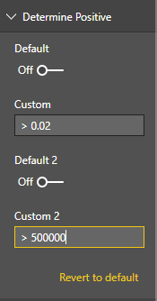
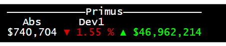
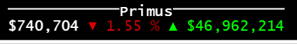

# XPO Power BI Scroller
The readme content of the original project is appened bellow

## Drescription
The purpose of this project is to take the already existing scroller from Power BI and build upon it to add more customization and for it to better fit the need of XPO. 

## Changes
### Visual:
Visually the custom visual has went through a complete overhaul. Instead of showing all the data on one line, with this new version the data can be shown on up to 3 lines (with more information being shown). 

New version on top and old on bottom:

### Data: 
The new version of the visual will now be able to take up to two deviation values. They each will have their on custom way of determining if the value should be considered good or bad.

Example on how to use the custom positive:

### Headers:
The ability to add headers has been added to the visual. This can allow for the user to specify the values that are being shown in the visual, making it more precise. If left empty, the header will not appear and if all are empty then the header line will be removed as a whole.

### Colours:
The ablility to change the positive and negative colours has been added in the formatting options. Note that only the deviation values itself will take on those colours (unless specified not to), whereas the category name and the absolute value will be the text colour that is specified in the formatting options.
________________________________________________________________________________________________________________________________________
# Scroller visual for Power BI

The Scroller visual by Fredrik Hedenström creates an animating scrolling text. You can use a custom text or create it from your dimensions and measures. Various settings makes it possible to control speed, size, status indications, coloring, etc.

### Copyrights

Copyright (c) 2017 Fredrik Hedenström

See the [LICENSE](/LICENSE) file for license rights and limitations (MIT). 
